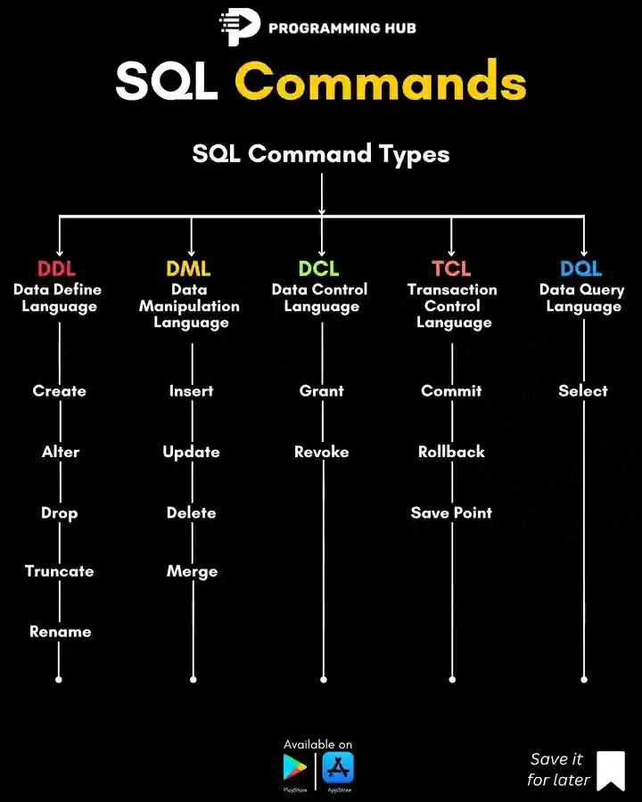

# MySQL assignment

The image below provides a high-level overview of SQL commands grouped into different categories (DDL, DML, DCL, TCL, and DQL).



Here's a quick guide on how to use them in MySQL. But first let start by creating our database `(odoi_db)` that we will use by:

```sh
CREATE DATABASE odoi_db;

# select our database
USE odoi_db;
```

## 1. DDL (Data Definition Language):

DDL statements deal with the structure of the database and its schema. Below are the commands:

**Create:** Create tables, databases, or indexes.

```sh
CREATE TABLE student_info(
    name VARCHAR(255),
    faculty VARCHAR(255),
    dept VARCHAR(255),
    field VARCHAR(255) DEFAULT 'quantum',
    admin_no INT NOT NULL UNIQUE,
    cgpa INT NOT NULL,
    serial INT NOT NULL AUTO_INCREMENT,
    PRIMARY KEY (`serial`),
    created datetime NOT NULL DEFAULT CURRENT_TIMESTAMP
);
```

**Alter:** Modify an existing table structure.

```sh
ALTER TABLE student_info ADD residence VARCHAR(255);
```

**Drop:** Delete tables, views, or databases.

```sh
DROP TABLE student_info;
```

**Truncate:** Remove all records from a table without deleting the table itself.

```sh
TRUNCATE TABLE student_info;
```

**Rename:** Change the name of a table.

```sh
RENAME TABLE student_info TO student_info_new;
```

## 2. DML (Data Manipulation Language):

DML commands are used to manipulate the data within tables.

**Insert:** Insert new records into a table.

```sh
INSERT INTO student_info(name, faculty, dept, field, admin_no, cgpa) VALUES ('Usman Musa', 'sciense', 'physics', 'quantum programming', 2021, 3.98);

INSERT INTO student_info(name, faculty, dept, admin_no, cgpa) VALUES ('Usman Musa', 'sciense', 'physics', 2022, 3.98);

INSERT INTO student_info(name, faculty, dept, admin_no, cgpa) VALUES ('Abdulhakeem Sanusi', 'sciense', 'computer science', 2023, 4.98);
```

**Update:** Update existing records.

```sh
UPDATE student_info SET name = 'Odoi', admin_no = 2024 WHERE dept = 'computer science';
```

**Delete:** Remove existing records from a table.

```sh
DELETE FROM student_info WHERE admin_no = 2022;
```

**Merge:** MySQL doesn’t have a MERGE statement, but you can use INSERT INTO ... ON DUPLICATE KEY UPDATE for similar functionality.

Suppose you have a users table and want to either insert a new user or update the existing user's data if their id already exists. This merge is available for such database `(SQL server or oracle)`

```sh
INSERT INTO student_info (name, faculty, dept, field, admin_no, cgpa) VALUES ('Usman Musa', 'sciense', 'physics', 'quantum programming', 2021, 3.98)
ON DUPLICATE KEY UPDATE name = 'Halima', faculty = 'sciense', dept = 'math', field = 'web development', admin_no = 2020, cgpa = 3.50;
```

## 3. DCL (Data Control Language):

DCL statements are used to manage privileges in MySQL.

**Grant:** Give privileges to users.

```sh
GRANT ALL PRIVILEGES ON odoi_db.* TO 'odoi'@'localhost';
```

**Revoke:** Remove privileges from users.

```sh
REVOKE ALL PRIVILEGES ON odoi_db.* FROM 'odoi'@'localhost';
```

## 4. TCL (Transaction Control Language):

TCL commands manage the changes made by DML statements, typically in transactions.

**Commit:** Save changes to the database permanently.

```sh
COMMIT;
```

**Rollback:** Revert changes made in a transaction.

```sh
ROLLBACK;
```

**Savepoint:** Set a point within a transaction to which you can rollback later.

```sh
SAVEPOINT savepoint_name;
```

## 5. DQL (Data Query Language):

DQL commands are used to query data from the database.

**Select:** Retrieve data from a database.

```sh
SELECT * FROM student_info WHERE dept = 'physics';
```

The above commands provides a high-level overview of SQL commands grouped into different categories (DDL, DML, DCL, TCL, and DQL). Thank you!

### DDL


### DML


### DCL


### TCL


### DQL

