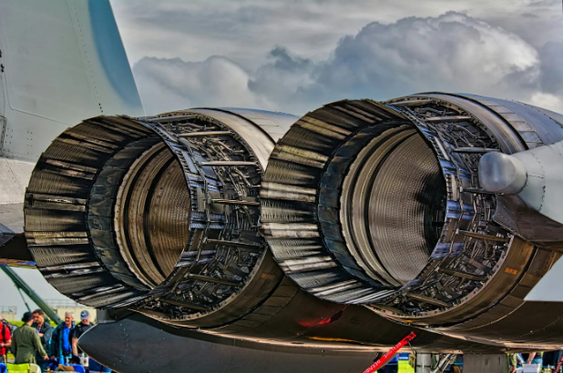

# Modeling Thrust Propulsion Systems

Modeling low-thrust propulsion systems is a crucial aspect of space mission planning and optimization. These systems, such as ion engines or Hall effect thrusters, are designed to provide efficient propulsion over long periods, making them ideal for deep space missions.

**Key Aspects of Modeling Low-Thrust Propulsion Systems:**

-   Thrust and Mass Flow Rate Equations: Accurate modeling of these equations is essential to predict the performance of low-thrust propulsion systems.
-   Trade-Offs Between Thrust, Fuel Efficiency, and Transfer Time: Modeling these systems helps engineers optimize trajectories, reducing fuel consumption and increasing mission duration.
-   Design and Sizing: Modeling informs the design and sizing of system components, ensuring proper sizing for mission requirements.
-   Performance Prediction and Verification: Accurate modeling enables engineers to predict system performance under various operating conditions, verifying that the system meets required specifications.

**Benefits of Modeling Low-Thrust Propulsion Systems:**

-   Improved Navigation and Control: Modeling helps improve navigation and control algorithms, enabling more precise control of spacecraft trajectories and attitudes.
-   Enhanced Robustness and Fault Tolerance: Simulating various failure scenarios and fault conditions helps engineers design more robust and fault-tolerant systems.
-   Reduced Development Costs and Risks: Modeling reduces development costs and risks associated with building and testing physical prototypes.

**What else ?**

-   Study the physics behind low-thrust propulsion, such as ion or Hall-effect thrusters.
-   Implement thrust and mass flow rate equations in a simulation.
-   Explore the trade-offs between thrust, fuel efficiency, and transfer time.

**Rocket Science is about newton’s law of motion**

-   First law: object remain at rest until force is apply to it.
-   Second law: force require to move object depend on it mass, the greater the mass, the more force require to cause acceleration.
-   Third law: every action there is equal and opposite reaction.

**Astrodynamic is the calculation of object in space (planet, asteroid, comet, spacecraft).**

-   Low thrust propulsion: Is essential for all space machine.
-   Auxiliary propulsion: Use in keeping space systems in desire location or for orientation. E.g Reaction control, drag makeup, retro, etc.
-   Primary propulsion: Include the moving of space vehicle from point-to-point in earth space as
-   Chemical propulsion: Use hydrogen-oxygen and storable propellents.
-   Electric propulsion: Low fuel consumption, fewer emission, less noise.

**Why modeling low thrust propulsion system?**

Modeling low-thrust propulsion systems is crucial for several reasons:

1. Mission Planning and Optimization

Low-thrust propulsion systems, such as ion engines or Hall effect thrusters, are often used in space missions where fuel efficiency is critical. Modeling these systems helps mission planners optimize trajectories, reducing fuel consumption and increasing mission duration.

2. Performance Prediction and Verification

Accurate modeling of low-thrust propulsion systems enables engineers to predict their performance under various operating conditions. This helps verify that the system meets the required specifications and identifies potential issues before they become major problems.

3. Design and Sizing

Modeling low-thrust propulsion systems informs the design and sizing of the system’s components, such as the power processing unit, propellant management system, and thruster itself. This ensures that the system is properly sized for the mission requirements.

4. Thruster Liftoff and Shutdown

Low-thrust propulsion systems often require careful management of thruster liftoff and shutdown to prevent damage or instability. Modeling these events helps engineers develop strategies for safe and reliable operation.

5. Integration with Other Spacecraft Systems

Low-thrust propulsion systems interact with other spacecraft systems, such as power, communication, and navigation. Modeling these interactions ensures that the propulsion system is properly integrated with the rest of the spacecraft.

6. Reducing Development Costs and Risks

By modeling low-thrust propulsion systems, engineers can reduce development costs and risks associated with building and testing physical prototypes.

7. Improving Navigation and Control

Modeling low-thrust propulsion systems helps improve navigation and control algorithms, enabling more precise control of the spacecraft’s trajectory and attitude.

8. Enhancing Robustness and Fault Tolerance

By simulating various failure scenarios and fault conditions, engineers can design low-thrust propulsion systems that are more robust and fault-tolerant.

9. Optimizing Propellant Utilization

Modeling low-thrust propulsion systems enables engineers to optimize propellant utilization, reducing waste and increasing the overall efficiency of the system.

10. Supporting Future Mission Concepts

Finally, modeling low-thrust propulsion systems supports the development of future mission concepts, such as deep space exploration and asteroid deflection.

By modeling low-thrust propulsion systems, engineers can create more efficient, reliable, and robust spacecraft that can accomplish a wide range of missions.
Data Preprocessing for Effective Machine Learning Models
