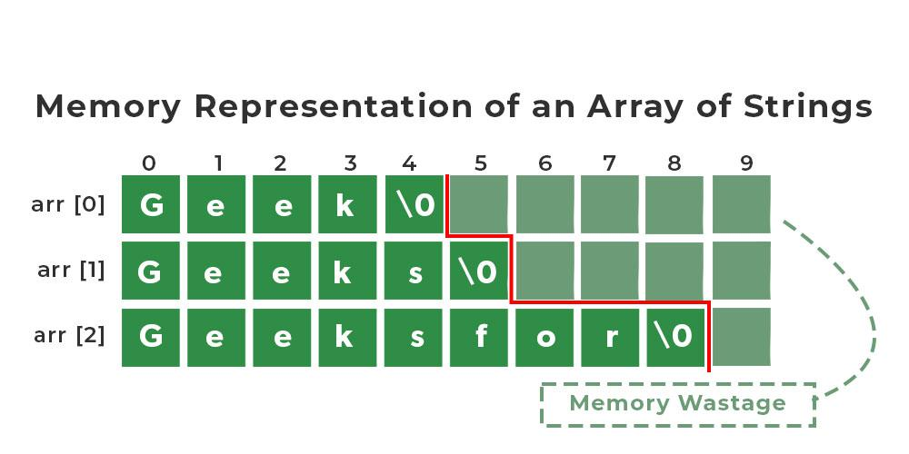
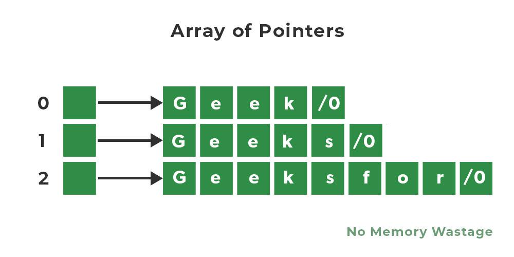

# Array in C programming

In C programming String is a 1-D array of characters and is defined as an array of characters.
But an array of strings in C is a two-dimensional array of character types.
Each String is terminated with a null character (\0). It is an application of a 2d array

## Syntax
```c++
char myArray[a][b]
//  a:
//    is a maximum number of character values that can be stored in each string array
//  b:
//    is the maximum number of string values that can be stored in a string array
```

## Example

```c++
// C Program to print Array of strings
#include <stdio.h>

// Driver code
int main(){
  char names[3][10] = {"Geek", "Geeks", "Geeksfor"};
  printf("Array items are: ");

  for (int i = 0; i < 3; i++){
    printf("%s\n", names[i]);
  }
  return 0;
}
```

### Output
```c++
String array Elements are:
Boy
Girl
Baby
```

Below is the Representation of the above program 

### illusion 1


We have 3 rows and 10 columns specified in our Array of String but because of prespecifying,
the size of the array of strings the space consumption is high. So, to avoid high space consumption in our program we can use an Array of Pointers in C

### Invalid Operations in Arrays of Strings
We can’t directly change or assign the values to an array of strings in C.

## Example
```c++
char names[3][10] = {"Geek", "Geeks", "Geeksfor"}
```

Here
```c++
names[0] = "woman";
// This will give an Error which says assignment to expression with an array type
```

To change values we can use strcpy() function in C

```c++
strcpy(names[0],"woman");
// This will copy the value to the names[0]
```

# Array of Pointers of Strings

In C we can use an Array of pointers. Instead of having a 2-Dimensional character array, we can have a single-dimensional array of Pointers. Here pointer to the first character of the string literal is stored.

## Syntax

```c++
char *names[] = {"Geek", "Geeks", "Geeksfor"}
```

### illusion 2


Below is the C program to print an array of pointers

```c++
// C Program to print Array of strings
#include <stdio.h>

// Driver code
int main(){
  char *names[] = {"Geek", "Geeks", "Geeksfor"};
  printf("Array items are: ");

  for (int i = 0; i < 3; i++){
    printf("%s\n", names[i]);
  }
  return 0;
}
```
